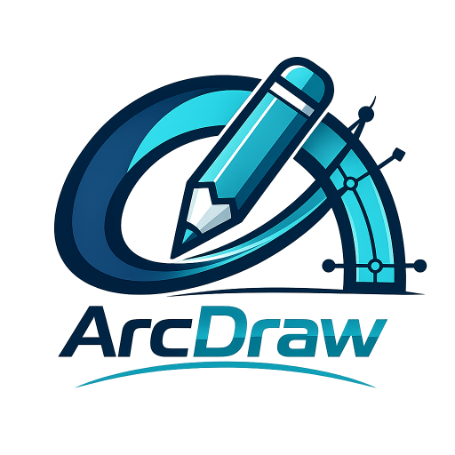
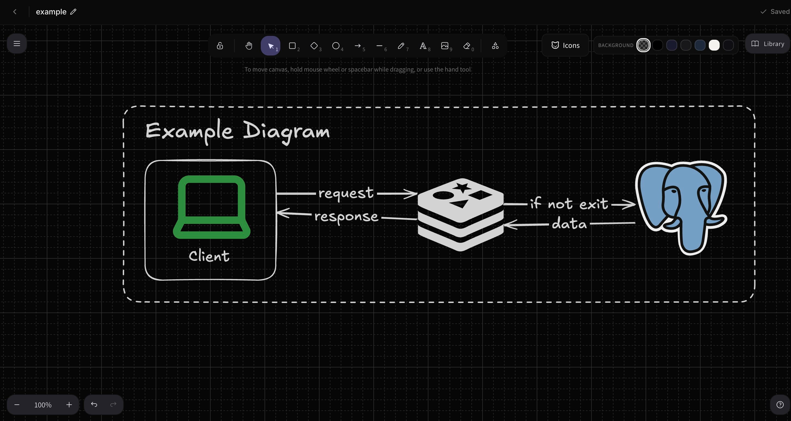
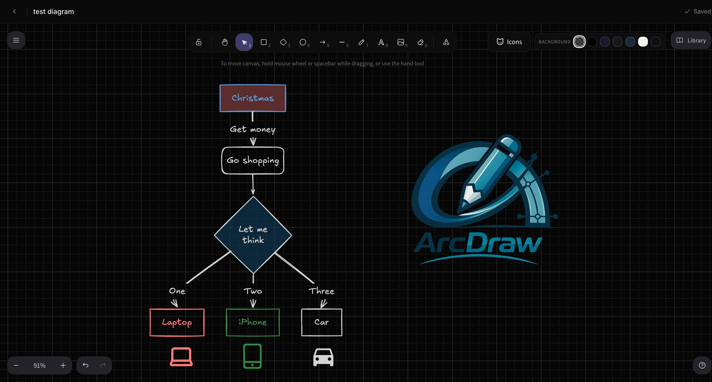
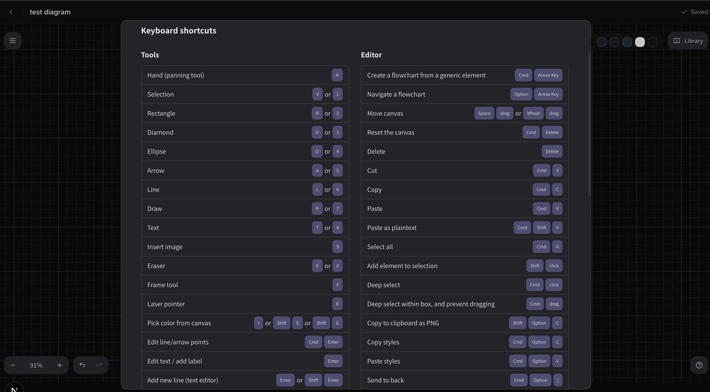

<div align="center">



# Arc Draw

**A local-first, infinite-canvas diagramming tool for architecture diagrams and system design.**

Draw instantly, stay offline-friendly, and let your work sync to the cloud on its own.

[Features](#-features) · [Screenshots](#-screenshots) · [Tech Stack](#-tech-stack) · [Getting Started](#-getting-started) · [Project Structure](#-project-structure)

</div>

---

## Overview

Arc Draw pairs [Excalidraw](https://excalidraw.com/)'s hand-drawn infinite canvas with a **local-first sync engine**: every stroke is written straight to your browser's IndexedDB first, then quietly synced to the server in the background. There's no spinner between you and the canvas — online or offline, the app never blocks on the network.

## ✨ Features

| | |
|---|---|
| 🖊️ **Infinite canvas** | Smooth, hand-drawn vector drawing powered by Excalidraw — pan and zoom without limits. |
| 📴 **Local-first architecture** | Edits save instantly to IndexedDB. Start drawing immediately, with zero network blocking. |
| ☁️ **Background syncing** | Changes push to the cloud automatically. Go offline, keep working, and reconnect whenever. |
| 🔀 **Conflict resolution** | Built-in safeguards stop stale offline edits from silently overwriting newer server changes. |
| 🎨 **Custom icon support** | Search, stamp, and dynamically recolor thousands of icons from Lucide and Iconify on the canvas. |
| 🌓 **Sleek monochrome UI** | A distraction-free, dark-mode-first design system built with Tailwind CSS v4 and Shadcn UI. |
| 🔐 **Secure authentication** | JWT-based auth sessions with Argon2 password hashing. |
| 🚀 **Marketing landing page** | An animated, feature-forward landing page for first-time visitors, separate from the authenticated app. |

## 📸 Screenshots

<div align="center">
  
  <br/><br/>
  
  <br/><br/>
  
</div>

## 🧱 Tech Stack

| Layer | Choice |
|---|---|
| Framework | [Next.js 16](https://nextjs.org/) (App Router) |
| Monorepo | [Turborepo](https://turbo.build/repo) + pnpm workspaces |
| Canvas | [Excalidraw](https://github.com/excalidraw/excalidraw) |
| Database | PostgreSQL, managed with [Drizzle ORM](https://orm.drizzle.team/) |
| Object storage | AWS S3 (or S3-compatible, e.g. MinIO for local dev) |
| Styling | Tailwind CSS v4 + Shadcn UI + [Base UI](https://base-ui.com/) |
| Client state & cache | Zustand + a custom IndexedDB wrapper (`lib/idb`) |
| Auth | JWT access/refresh tokens, Argon2 password hashing |

## 🗂️ Project Structure

```
arc-draw/
├── apps/
│   └── web/                          # The Next.js application
│       ├── app/
│       │   ├── (marketing)/          # Public landing page ("/")
│       │   ├── (auth)/               # /login and /register
│       │   ├── (app)/
│       │   │   ├── dashboard/        # Authenticated diagrams dashboard ("/dashboard")
│       │   │   └── diagram/[id]/     # The diagram editor
│       │   └── api/                  # Auth, diagrams, and asset routes
│       ├── components/
│       │   ├── canvas/               # ExcalidrawCanvas, icon picker, sync/conflict UI
│       │   ├── dashboard/            # Diagram cards, logout button
│       │   ├── marketing/            # Landing page nav + scroll animations
│       │   └── ui/                   # Shared primitives (Shadcn-based)
│       ├── lib/
│       │   ├── idb/                  # IndexedDB wrapper for local-first storage
│       │   ├── s3/                   # S3 client for asset/export storage
│       │   └── auth/                 # Token handling helpers
│       ├── drizzle/                  # SQL migrations
│       └── proxy.ts                  # Auth-gating middleware (renamed in Next.js 16)
├── docker-compose.yml                 # Postgres + MinIO for local dev
└── turbo.json
```

**Route map:**

| Path | Access | Description |
|---|---|---|
| `/` | Public | Animated marketing landing page |
| `/login`, `/register` | Public | Auth pages |
| `/dashboard` | Authenticated | Grid of your diagrams, create/rename/duplicate/delete |
| `/diagram/[id]` | Authenticated | The Excalidraw-powered editor |

## 🚀 Getting Started

### Prerequisites

- Node.js v20+
- [pnpm](https://pnpm.io/)
- A running PostgreSQL instance and an S3-compatible bucket (Docker Compose is provided for both)

### 1. Clone and install

```sh
git clone https://github.com/SurajAiri/arc-draw.git
cd arc-draw
pnpm install
```

### 2. Start Postgres + MinIO (local dev)

```sh
docker compose up -d
```

This starts Postgres on `localhost:5433` and MinIO on `localhost:9000` (S3 API) with its console at `localhost:9001` (`minioadmin` / `minioadmin`), and creates the `diagrams` bucket automatically.

### 3. Configure environment variables

Copy `apps/web/.env.example` to `apps/web/.env` and fill in the values:

| Variable | Description |
|---|---|
| `DATABASE_URL` | PostgreSQL connection string |
| `S3_ENDPOINT` | S3-compatible endpoint (MinIO for local dev) |
| `S3_REGION` | S3 region |
| `S3_ACCESS_KEY` / `S3_SECRET_KEY` | S3 credentials |
| `S3_BUCKET` | Bucket used for diagram assets/exports |
| `JWT_SECRET` | Long random string used to sign auth tokens — **generate a fresh one before deploying anywhere beyond localhost** |

### 4. Run database migrations

```sh
cd apps/web
pnpm drizzle-kit push
```

### 5. Start the dev server

From the repo root:

```sh
pnpm run dev
```

Visit **http://localhost:3000** — you'll land on the public marketing page. Register an account to reach the dashboard.

### Available scripts

| Command | Runs |
|---|---|
| `pnpm dev` | Starts the dev server for all apps in the monorepo |
| `pnpm build` | Production build |
| `pnpm lint` | Lint all workspaces |
| `pnpm check-types` | TypeScript project references check |
| `pnpm format` | Prettier over `.ts`, `.tsx`, and `.md` files |

## 🏗️ Architecture Notes

- **`components/canvas/ExcalidrawCanvas.tsx`** — the core wrapper around Excalidraw. Handles the local-first save debounce, SVG icon rendering, and background server syncing.
- **`lib/idb/index.ts`** — a lightweight IndexedDB wrapper managing the local cache of diagrams and their sync state.
- **`proxy.ts`** — Next.js 16's middleware equivalent; gates every route except the marketing page, auth pages, and `/api/auth/*` behind a valid access or refresh token cookie.

## 🤝 Contributing

Issues and pull requests are welcome. For larger changes, please open an issue first to discuss what you'd like to change.

## 📄 License

This project is proprietary and confidential.
